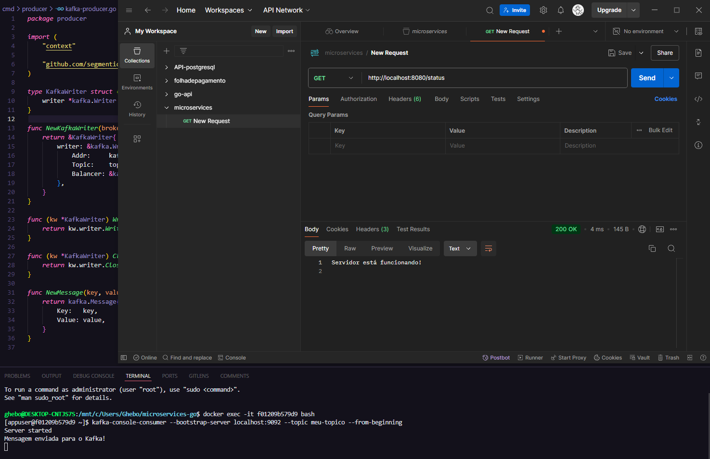

## Microserviços em GO

Estudo realizado para aprendizagem, criando micro serviços em go, utilizando docker, postgresql, postman e kafka. - [front-end](https://github.com/Ghenoo/front-microgo) sendo criado.

## Ferramentas e Pacotes

- [Gin-gonic](https://github.com/gin-gonic/gin) -> Web Server
- [Gorm](https://gorm.io/index.html) -> ORM
- [Air](https://github.com/air-verse/air) -> refill console
- [Docker](https://docs.docker.com/desktop/) -> Container
- [Kafka](https://docs.docker.com/desktop/) -> Eventos
- [Postman](https://docs.docker.com/desktop/) -> Requisições
- [Postgresql](https://docs.docker.com/desktop/) -> database
- [Go](https://docs.docker.com/desktop/) -> Stack

## Exemplo

